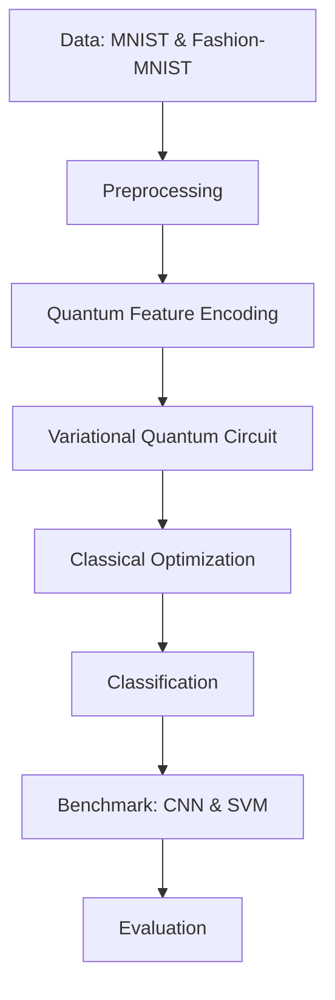

# Hybrid Quantum Neural Network for Intelligent Image Classification (HQNN-IIC)

> A hybrid quantum-classical framework for image classification, combining quantum feature encoding and variational quantum circuits with classical optimization — compatible with current NISQ-era hardware.

**Status:** Work in progress

---

## Overview

Classical deep learning models for image classification demand heavy compute and long training times, and scaling becomes harder as datasets grow. Quantum computing offers an alternative route via superposition and entanglement, but current hardware is still limited (NISQ era).

This project explores a Hybrid Quantum Neural Network (QNN) that:

- Encodes classical image features into quantum states
- Learns feature representations via a variational quantum circuit
- Updates parameters using classical optimization, keeping the approach practical on today's hardware
- Benchmarks performance against conventional models (CNN, SVM)

**Domain:** Quantum Computing
**SDG Alignment:** SDG 9 — Industry, Innovation and Infrastructure

---

## Objectives

1. Design a hybrid quantum-classical framework combining quantum feature encoding with variational quantum circuits for image classification.
2. Train the model using classical optimizers compatible with current NISQ-era hardware, on MNIST and Fashion-MNIST.
3. Evaluate against conventional ML models (CNN, SVM) using accuracy, precision, recall, F1-score, training time, and computational efficiency.

---

## Methodology

1. **Preprocess** — resize, normalize, and reduce dimensionality to match the number of qubits.
2. **Encode** — transform classical features into quantum states (angle or amplitude encoding).
3. **Classify** — pass encoded states through a variational quantum circuit (trainable gates + entanglement layers).
4. **Train & Benchmark** — optimize parameters with a classical optimizer, then compare against CNN and SVM baselines.



---

### Folder Structure

```text
hqnn-iic/
├── data/
│ ├── raw/
│ └── processed/
├── notebooks/
│ ├── 01_eda.ipynb
│ └── 02_quantum_circuits.ipynb
├── src/
│ ├── data/
│ │ ├── **init**.py
│ │ └── loader.py
│ ├── quantum/
│ │ ├── **init**.py
│ │ ├── encoding.py
│ │ └── qnn.py
│ ├── models/
│ │ ├── **init**.py
│ │ ├── cnn.py
│ │ └── svm.py
│ ├── training/
│ │ ├── **init**.py
│ │ └── train.py
│ └── evaluation/
│ │ ├── **init**.py
│ │ └── metrics.py
├── tests/
│ ├── test_encoding.py
│ └── test_models.py
├── scripts/
│ └── run_pipeline.py
├── README.md
└── requirements.txt
```

---

## Tech Stack

| Tool                                 | Purpose                             |
| ------------------------------------ | ----------------------------------- |
| [Qiskit](https://qiskit.org/)        | Quantum circuit design & simulation |
| Python                               | Core implementation & pipeline      |
| Matplotlib                           | Visualization & result plotting     |
| scikit-learn / PyTorch or TensorFlow | Classical baselines (CNN, SVM)      |
| NumPy                                | Numerical processing                |

---

## Evaluation Metrics

The model will be evaluated and compared against CNN and SVM baselines on:

- Accuracy
- Precision
- Recall
- F1-score
- Training time
- Computational efficiency

> Results are pending — this project is currently in development.

---

```

```
